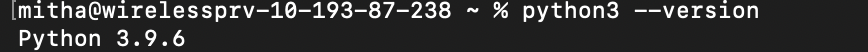
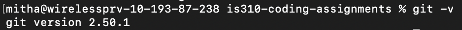
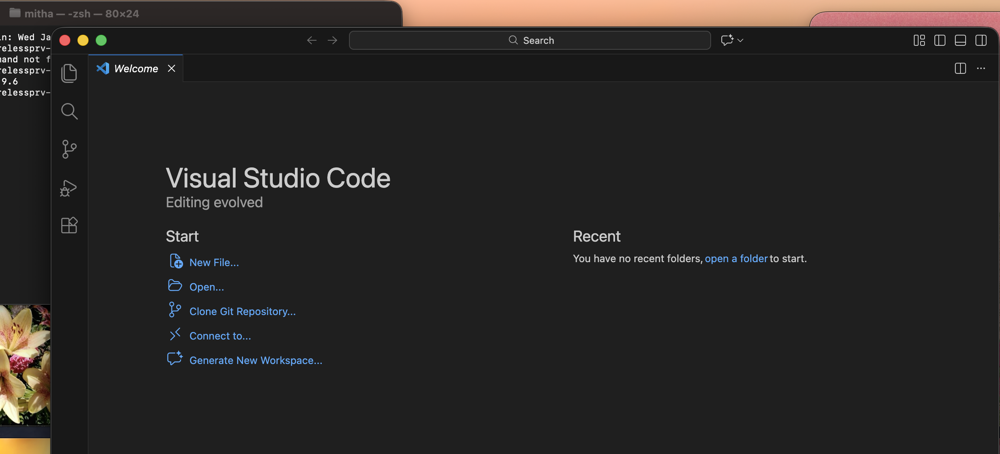

# Init IS310 Homework

# Hypothesis username
jaz2100

## Proof of Installation

1. Python

2. Git

3. VS Code

4. AI Tool/Workflow 

How will you work with AI? What tools if any do you plan to use?
I plan to use AI such as ChatGPT or Google Gemini to help me with maybe finding resources of where to find data.
